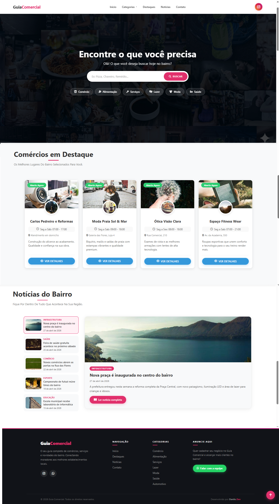

# 🗺️ Guia Comercial Local

> Plataforma web para descoberta de comércios, serviços e novidades do bairro — moderna, responsiva e sem frameworks.

🔗 **[Acesse o projeto ao vivo](https://danilojduarte.github.io/GuiaComercial/)**

---

## 📱 Preview

| Desktop | Mobile |
|--------|--------|
|  | |  | 

---

## 📋 Sobre o Projeto

O **Guia Comercial Local** nasceu da ideia de conectar moradores aos melhores estabelecimentos do bairro de forma simples, rápida e agradável. O projeto foi desenvolvido inteiramente com tecnologias nativas da web — sem frameworks, sem dependências pesadas — priorizando performance, acessibilidade e uma ótima experiência em qualquer dispositivo.

---

## ✨ Funcionalidades

### 🔍 Busca Inteligente
- Pesquisa em tempo real por nome, descrição, categoria e palavras-chave do estabelecimento
- Feedback visual quando nenhum resultado é encontrado, com sugestões de busca alternativas
- Teclado virtual escondido automaticamente após a busca no mobile

### 🗂️ Filtros por Categoria
- Filtros rápidos via quick-cards na hero section
- Dropdown de categorias na navbar (desktop)
- Menu lateral no mobile — todos sincronizados e funcionais
- Scroll automático até os resultados ao filtrar

### 🏪 Cards de Lojistas
- Status em tempo real: **Aberto Agora** / **Fechado** / **Fechado Hoje**
- Lógica de horário cruzada com dias da semana (`diasFuncionamento`)
- Badge animado com pulso verde para estabelecimentos abertos
- Modal completo com banner, logo, horário, endereço, WhatsApp e Google Maps

### 📰 Seção de Notícias
- Layout de news reader: lista lateral + painel de destaque (desktop)
- Feed vertical compacto com abertura direta no modal (mobile)
- Notícias cadastradas diretamente no `index.html` — fácil de atualizar

### 🎨 Experiência Visual
- Animações de entrada escalonada no Hero
- Scroll Reveal nos cards, seções e footer via `IntersectionObserver`
- Micro-interações em botões, links e cards
- Transições suaves na abertura/fechamento de modais
- Botão flutuante de voltar ao topo

### ⚡ Performance
- Carregamento não bloqueante do Font Awesome
- `DocumentFragment` para inserção eficiente dos cards no DOM
- Cache do JSON de lojistas via `sessionStorage`
- `loading="lazy"` em todas as imagens
- Throttle no scroll listener
- Respeito à preferência `prefers-reduced-motion`

### 📱 Responsividade
- Layout adaptado para desktop, tablet e mobile
- Carrossel horizontal de cards abaixo de 900px
- Menu hambúrguer com animação no mobile
- Seção de notícias com comportamento diferente por breakpoint

---

## 🛠️ Tecnologias Utilizadas

| Tecnologia | Uso |
|---|---|
| **HTML5 Semântico** | Estrutura acessível com roles e atributos ARIA |
| **CSS3 Puro** | Variáveis CSS, Grid, Flexbox, animações e media queries |
| **JavaScript ES6+** | Lógica de busca, filtros, modais e animações |
| **Font Awesome 6** | Ícones vetoriais |
| **JSON** | Base de dados dos lojistas |
| **IntersectionObserver API** | Scroll Reveal sem bibliotecas externas |
| **SessionStorage** | Cache do JSON para carregamento instantâneo |

---

## 📁 Estrutura do Projeto

```
GuiaComercial/
├── index.html          # Estrutura principal + dados das notícias
├── css/
│   └── style.css       # Estilos globais, componentes e animações
├── js/
│   ├── script.js       # Lógica completa da aplicação
│   └── lojistas.json   # Base de dados dos estabelecimentos
└── img/
    ├── desktop.png     # Preview desktop
    └── mobile.png      # Preview mobile
```

---

## 🗄️ Como Cadastrar um Lojista

Abra o arquivo `js/lojistas.json` e adicione um novo objeto seguindo o padrão:

```json
{
  "id": 21,
  "nome": "Nome do Estabelecimento",
  "isDestaque": true,
  "categoria": "Alimentação",
  "abre": "08:00",
  "fecha": "18:00",
  "horarioTexto": "Seg a Sex: 08:00 - 18:00",
  "diasFuncionamento": [1, 2, 3, 4, 5],
  "endereco": "Rua Exemplo, 100",
  "descricao": "Descrição do estabelecimento.",
  "keywords": "palavra, chave, para, busca",
  "imagemCapa": "URL da imagem de capa",
  "logo": "URL do logo",
  "linkInsta": "URL do Instagram",
  "linkWhats": "5511999999999",
  "linkMaps": "URL do Google Maps"
}
```

> **Dias da semana:** `0`=Dom `1`=Seg `2`=Ter `3`=Qua `4`=Qui `5`=Sex `6`=Sáb

---

## 📰 Como Adicionar uma Notícia

No `index.html`, localize o bloco `window.noticias` e adicione:

```js
{
  id: 6,
  titulo: "Título da notícia",
  categoria: "Categoria",
  data: "01 de maio de 2026",
  resumo: "Texto curto exibido no painel de destaque.",
  textoCompleto: "Texto completo exibido no modal ao clicar em 'Ler mais'.",
  imagem: "URL da imagem"
}
```

---

## 🚀 Como Rodar Localmente

```bash
# Clone o repositório
git clone https://github.com/danilojduarte/GuiaComercial.git

# Entre na pasta
cd GuiaComercial

# Abra com um servidor local (necessário para o fetch do JSON funcionar)
npx serve .
# ou com a extensão Live Server do VS Code
```

> ⚠️ Abrir o `index.html` diretamente no navegador pode bloquear o fetch do JSON por restrições de CORS. Use sempre um servidor local.

---

## 📄 Licença

Este projeto está sob a licença MIT.  
Desenvolvido por **[Danilo.Dev](https://github.com/danilojduarte)** © 2026
